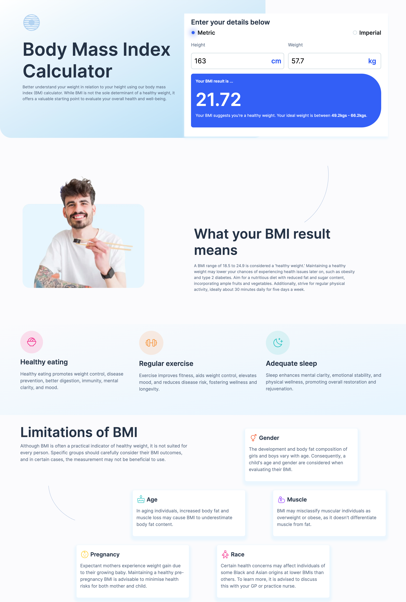
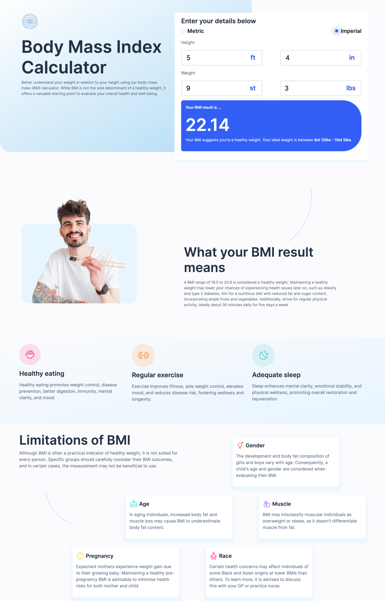
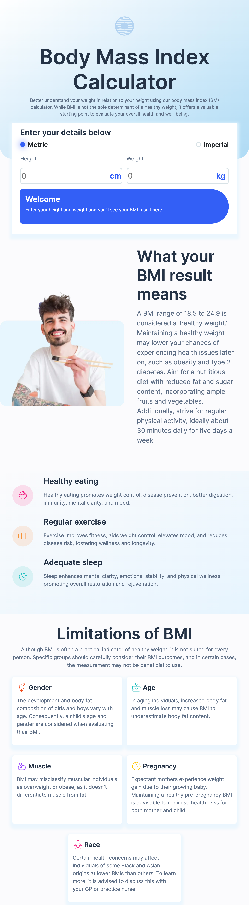
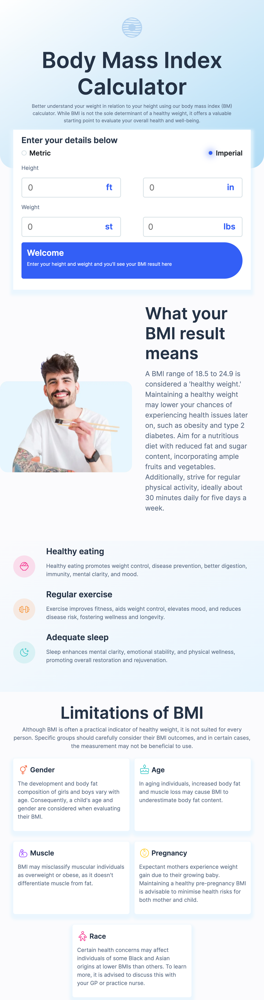
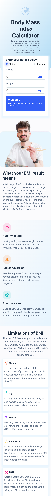
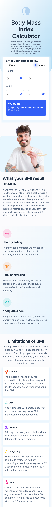

# frontendmentor-bmi-calculator

This is a solution to the [Body Mass Index calculator challenge on Frontend Mentor](https://www.frontendmentor.io/challenges/body-mass-index-calculator-brrBkfSz1T). This project is an interesting challenge to experiment with responsive layouts shift and angular.

## Table of contents

- [Overview](#overview)
  - [The challenge](#the-challenge)
  - [Screenshot](#screenshot)
  - [Links](#links)
- [My process](#my-process)
  - [Built with](#built-with)
  - [What I learned](#what-i-learned)
  - [Continued development](#continued-development)
  - [Useful resources](#useful-resources)
- [Author](#author)

## Overview

This project involves creating a BMI calculator challenge provided by Frontend Mentor. It utilizes Angular to implement fundamental functionalities of the BMI calculator while exploring responsive design techniques through Flexbox and CSS Grid to adapt layouts across different screen sizes. The challenge aims to showcase proficiency in Angular development, responsive design principles, and layout manipulation using modern CSS techniques.

### Features

Users should be able to:

- Select whether they want to use metric or imperial units
- Enter their height and weight
- See their BMI result, with their weight classification and healthy weight range
- View the optimal layout for the interface depending on their device's screen size
- See hover and focus states for all interactive elements on the page

### Screenshot

| Metric Calculation: Desktop | Imperial Calculation: Desktop |
|:---------:|:---------:|
|  |  |

| Metric Option: Tablet | Imperial Option: Tablet |
|:---------:|:---------:|
|  |  |

| Metric Option: Mobile | Imperial Option with active state: Mobile |
|:---------:|:---------:|
|  |  |

### Links

- Solution URL: [BMI Calculator - Github](https://github.com/JoanaMamley/frontendmentor-bmi-calculator)
- Live Site URL (Soon): [Add live site URL here](https://your-live-site-url.com)

## My process

### Built with

- [Angular](https://angular.io/) - JS library
- [Bootsrap](https://getbootstrap.com/docs/5.0/getting-started/introduction/) - For styles
- [CSS Grid](https://scrimba.com/learn/cssgrid)
- CSS custom properties
- Flexbox
- Typescript
- Mobile-first workflow

### What I learned

- Breakpoints for Responsive Layouts: Through hands-on experience with breakpoints, I gained valuable insights into optimizing layouts for different screen sizes, enhancing adaptability across various devices.

- Angular Components and Data Binding: Immersing myself in Angular components and data binding not only expanded my understanding but also equipped me with practical skills essential for building dynamic 
and interactive web applications.

- Mastery of CSS Grids in Desktop Layout: Tackling the grid layout section presented a rewarding challenge, enhancing my proficiency with CSS grids and empowering me to create more sophisticated and visually appealing desktop interfaces.

### Continued development

- Seamless Transition from Tablet to Desktop: Implement a more flexible and scalable approach for transitioning between tablet and desktop layouts. Rather than relying solely on conditions within components to switch between HTML code, explore utilizing responsive design principles and CSS techniques such as media queries and flexbox/grid layouts. This approach ensures smoother transitions and maintains consistency across different screen sizes without the need for conditional logic cluttering the components. Additionally, consider adopting a mobile-first approach to design, prioritizing the layout and functionality for smaller screens and progressively enhancing it for larger devices, including tablets and desktops. This strategy fosters a more cohesive user experience across various devices while streamlining development and maintenance efforts.

- Implement Testing Suite: Introduce comprehensive unit and integration tests for the project, ensuring robustness and reliability in    functionality across various scenarios.

- Deployment Automation: Implement CI/CD pipelines to automate the deployment process, facilitating seamless updates and ensuring the latest features are readily accessible to users.

### Useful resources

- [angular.io](https://angular.io/docs) - I followed the documentation for angular to implement most of the parts.
- [bootstrap](https://getbootstrap.com/docs/5.0/getting-started/introduction/) - Bootstrap also helped in easier styling of certain parts of the project.
- [CSS Grid](https://scrimba.com/learn/cssgrid) - This CSS grid course was very useful in understanding grid layouts

## Author

- Website - [Joana Mamley Teye](https://github.com/JoanaMamley)
- Frontend Mentor - [@JoanaMamley](https://www.frontendmentor.io/profile/JoanaMamley)
- LinkedIn - [@joana-mamley-teye](www.linkedin.com/in/joana-mamley-teye)